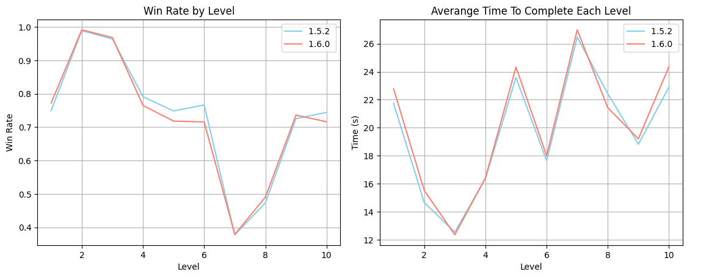

#### Question 1:
- Well, to know if the improvement of Tutorial in-game version 1.6.0 has impacted the User Experience better than in-game version 1.5.2. We need to identify some metrics between two versions to compare before give conclude if version 1.6.0’s tutorial is better. Based on the data columns, I were try to create some metrics to measure:

    - **Tutorial Complete Rate**: The rate of users who complete the entire tutorial.
    - **Performance of gameplay after tutorial**:
        - **Win Rate**: Win rate between two versions. A good tutorial that impacted to user experience will help them increase win rate when they just start (let assume first 10 level).
        - **User Engagement**: A good tutorial will help users understand the game better and increase engagement. Otherwise, if the tutorial is confusing or not good, users may quickly abandon the game.

#### Question 2:
- Let hand on to analyze the data base on some metrics we were identify above, the data will show us does the tutorial change in-game version 1.6.0 really impacted user experience better version 1.5.2 or not.
- I’m going to use Python to analyze it and will share my thoughts below.
    #### The Tutorial Complete Rate:
    - Using python and calculate the complete rate for each version (For detail, you can take a look at the `analyze.ipynb` notebook)

        
    - Well, as we can see here, the tutorial complete rate from version 1.6.0 is lower than version 1.5.2 ~0.6%. From my opinion, that maybe because in version 1.6.0 the steps for tutorial is double than version 1.5.2 (From 4 steps to 8 steps). Let try analyze it to verify my opinion.
        
    - So the chart shows that the increased number of steps is not the issue affecting the completion rate. The percentage of users reaching the final tutorial step is almost the same across both versions
    - Another hypothesis to consider is whether the values we calculated here hold statistical significance or not. Let try calculate **Z-score** and **p-value** to verify this.
        - We have:
            - $ p_1 = 0.162 $
            - $ p_2 = 0.098 $
            - $ N_1 = 40118 $
            - $ N_2 = 68469 $
            - $ p $ = $\frac{6497 + 6712}{40118 + 68469} $ = $ 0.121 $

        - Z-score:
            $
            Z = \frac{p_1 - p_2}{\sqrt{p \cdot (1 - p) \cdot \left( \frac{1}{N_1} + \frac{1}{N_2} \right)}}
            $ = 31.211
            
            where:
            - $ p $ is the combined completion rate across both versions.
            - $ N_1 $ and $ N_2 $ are the total number of users in versions 1.5.2 and 1.6.0, respectively.
            - $ p_1 $ and $ p_2 $ are represent the completion rate for 1.5.2 and 1.6.0.
        - With **Z-score** = 31.211, the **p-value** is nearly to 0. So it really have statistically significant and not due to random chance. That mean the tutorial in version 1.6.0 likely bad than version 1.5.2.
    #### Win Rate:
    - The reason I only selected the first 10 levels is because I believe the tutorial will impact these lower levels as users are just beginning to engage with the game. For levels beyond 10, I think users have gradually become familiar with the game, and how far they progress will depend more on individual skill rather than the tutorial's influence.
    
    - Hmmm, the win rate and time complete for first 10 level is not different to much between two version. So it not a good metrics to choose, no insigh at all.
    #### User Engagement
    - From what I understand, 'ss' marks each time a user starts a new game session, which is crucial for measuring retention - how often users return to the game.
    - A good tutorial will encourage users to return and play more. Total interaction time: Users who understand the game well (thanks to the tutorial) tend to play longer.
    - The goal is to measure how many times users return to the game within the first 7 days
    
        - Version 1.6.0: 1.25 days
        - Version 1.5.2: 0.98 days
        - Users in version 1.6.0 play approximately 0.27 days longer (≈ 6.5 hours)
        - Version 1.6.0: 2.83 sessions
        - Version 1.5.2: 2.51 sessions
        - Users in version 1.6.0 return to play more frequently (12.7% increase)

    - Statistical testing with Z-score and p-value shows:
        - Z-score = 8.2706
        - p-value = 0 (< 0.05)
    - From this, we can conclude that the difference in retention between the two versions is statistically significant (version 1.6.0 higher than 1.5.2)
    - However, to further examine the magnitude of improvement, we calculated Cohen's d:
        - Cohen's d = 0.1415 (< 0.2)
    - Although the difference is statistically significant, the small effect size indicates that the improvement is modest. Nevertheless, it's sufficient to confirm that version 1.6.0 is slightly more stable than 1.5.2.

    ### Summary
    After analyzing multiple metrics comparing versions 1.5.2 and 1.6.0, we can draw the following summary

    **Tutorial Completion Rate**:
    - Version 1.6.0 shows a lower completion rate (-0.6%)
    - This difference is statistically significant (Z-score = 31.211, p-value ≈ 0)
    - The number of tutorial steps (4 vs 8) isn't the main factor affecting completion

    **Win Rate** (First 10 Levels):
    - No significant differences observed between versions
    - Not a decisive metric for determining tutorial effectiveness

    **User Engagement**:
    - Version 1.6.0 shows better retention metrics:
        * Longer gameplay duration (≈ 6.5 hours)
        * Higher session count
    - Statistical validation:
        * Significant difference confirmed (p-value < 0.05)
        * Small but positive effect size (Cohen's d = 0.1415)
    ### Conclusion:
    - Although the tutorial completion rate is lower than version 1.5.2 but users on version 1.6.0 show better engagement: they play longer and return more frequently. This is a positive sign for long-term user experience, so I believe we can consider rolling out version 1.6.0 to 100%.

### Question 3:
- Based on my experience after trying the tutorial, I have some following suggestion for improved user experience:

    - Since it's a tutorial, we should let users know what they are drawing in advance by showing them the completed image first. Personally, I felt a bit confused during the experience because I didn't know what I was making until the end of the tutorial when I realized it was an apple tree painting.
    - Additionally, we could add colors to each drawing section during the instructions for users.
    - Specifically, to improve clarity for users, the flow of the tutorial could be as follows:
    - 
    - To conclude, the current tutorial for the pixel art game could be significantly improved by showing players the final image they will be creating at the beginning of the tutorial. This would eliminate the confusion I experienced, where I didn't understand the purpose of the tutorial until it was completed.

